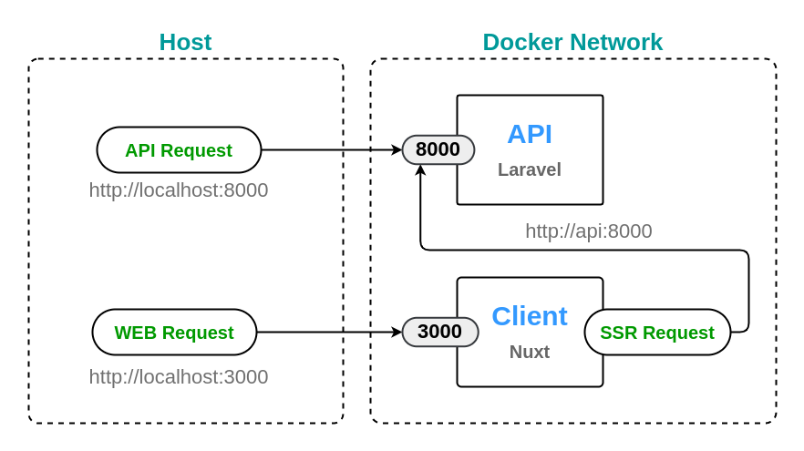

# Documentation de l'application Calendar

## Aperçu

Cette documentation fournit un aperçu de l'application Calendar construite en utilisant un modèle dockerisé pour Laravel et Nuxt. Elle inclut les instructions d'installation, les détails de la stack, la communication réseau, et comment l'API et l'application interagissent.

## 🍬 Aperçu de la Stack

### API
- **Framework**: Laravel (version la plus récente) + serveur Octane
- **Base de données**: PostgreSQL
- **Cache**: Redis
- **Mail**: Mailpit
- **Stockage**: Minio (compatible S3)

### WEB
- **Framework**: Nuxt (version la plus récente)

### Proxy inverse
- **Serveur**: Traefik

## ⚙ Installation

### Cloner le dépôt
```bash
git clone https://github.com/votre-repo/calendar-app.git
```

### Installer les composants
Suivez les instructions d'installation pour chaque composant :
- API
- WEB
- [Proxy inverse](reverse-proxy/README.md) (optionnel pour le développement local)

### Installation de l'API

#### Installation automatique
Exécutez le script d'installation pour automatiser le processus :
```bash
./install.sh
```
Ce script installe une application Laravel avec Octane

#### Construction des images
Pour l'environnement  de dev :
```bash
docker compose -f compose.yaml build
```

#### Démarrer les conteneurs
```bash
docker compose -f compose.yaml up
```

Visitez [http://localhost:8000](http://localhost:8000).

#### Arrêter les conteneurs
```bash
docker compose -f compose.local.yaml down
```

### Installation du WEB

installez les dépendances et démarrez l'application Nuxt :

```bash
 cd web && yarn install && yarn run dev
```

Visitez [http://localhost:3000](http://localhost:3000).


### Arrêter les conteneurs
```bash
docker compose -f compose.local.yaml down
```

## 🔌 Communication réseau



Dans un environnement de développement local, les requêtes API et WEB envoyées par le navigateur sont proxyfiées via des ports publiés vers les instances de serveurs en cours d'exécution. Les requêtes SSR, envoyées par le serveur node, doivent être dirigées vers l'hôte du service docker de l'API. Pour la production, configurez un serveur de proxy inverse pour gérer toutes les requêtes entrantes.

## Aperçu de l'application

### API

L'API est construite en utilisant Laravel, en tirant parti d'Octane pour des performances améliorées. Elle utilise PostgreSQL pour la base de données, Redis pour la mise en cache, Mailpit pour le test des emails en environnement local et Minio pour le stockage compatible S3.

Caractéristiques principales :
- **Laravel Octane** pour des performances élevées
- **PostgreSQL** comme base de données principale
- **Redis** pour la mise en cache et les files d'attente
- **Mailpit** pour le test des emails en local
- **Minio** pour le stockage d'objets

### WEB

L'application web est construite en utilisant Nuxt.js, un framework puissant basé sur Vue.js. Nuxt permet de créer des applications universelles, générées statiquement ou rendues côté serveur (SSR), offrant une flexibilité et des performances améliorées.

Caractéristiques principales :
- **Nuxt.js** pour le rendu côté serveur et les applications universelles
- **Communication API** avec Laravel pour récupérer les données
- **Gestion de l'état** avec Pinia ou Vuex
- **Support de TypeScript** pour un développement plus robuste

## Fonctionnement de l'API et de l'application

### Communication entre API et Application

- **Requêtes API**: Les requêtes du navigateur pour l'API et l'application WEB sont envoyées via des ports publiés directement aux instances de serveur en cours d'exécution.
- **Requêtes SSR**: Pour les requêtes de rendu côté serveur, le serveur node envoie les requêtes directement à l'hôte du service docker de l'API.

### Flux de données

1. **L'utilisateur interagit** avec l'application Nuxt dans le navigateur.
2. **Nuxt envoie des requêtes** à l'API Laravel pour récupérer ou envoyer des données.
3. **Laravel traite les requêtes** et interagit avec PostgreSQL, Redis, ou Minio selon les besoins.
4. **Les réponses de l'API** sont renvoyées à Nuxt pour mettre à jour l'interface utilisateur.
5. **Nuxt peut effectuer un rendu côté serveur** (SSR) pour améliorer les performances et le référencement (SEO).

Cette documentation fournit les bases nécessaires pour comprendre et utiliser l'application Calendar. Pour des détails plus spécifiques sur l'implémentation du code ou les fonctionnalités avancées, référez-vous aux fichiers README de chaque composant (API, WEB, Proxy inverse).
